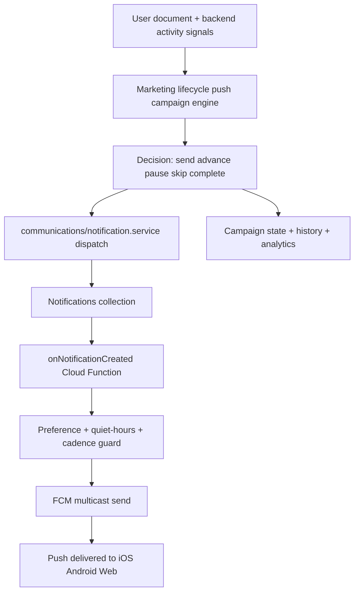

# Elite Role-Based Push Campaigns Plan

## Objective

Build an elite backend-owned push campaign system that delivers smart,
role-based notifications for athletes, coaches, and directors using the same
production push rail that already powers the rest of NXT1.

The system must:

- keep business logic on the backend
- use durable campaign state instead of one-off sends
- reuse the existing unified notification dispatch flow
- support role-aware copy and campaign branching
- respect push preferences, quiet hours, and cadence caps
- expose clear analytics and auditability

## Non-Negotiable Architecture

### Existing boundaries to preserve

- Marketing lifecycle decides who gets a campaign push, when, and why.
- Communications notification service is the only backend push dispatch entry.
- Firebase notification trigger remains the only FCM delivery processor.
- Frontend only manages settings UI and token registration, not campaign logic.

### Existing anchor files

- `backend/src/services/marketing/lifecycle/signup-drip.service.ts`
- `backend/src/services/communications/notification.service.ts`
- `apps/functions/src/notification/onNotificationCreated.ts`
- `backend/src/routes/marketing/cron.routes.ts`
- `apps/functions/src/scheduled/signupDrip.ts`
- `packages/core/src/models/content/notification.model.ts`
- `packages/core/src/models/user/user.model.ts`
- `packages/core/src/constants/notification.constants.ts`
- `packages/core/src/constants/user.constants.ts`
- `backend/src/dtos/settings.dto.ts`

## System Design



## Target File Structure

```text
backend/src/services/marketing/
├── lifecycle/
│   ├── signup-drip.service.ts
│   ├── push-drip.service.ts
│   ├── push-drip.types.ts
│   └── __tests__/
├── push/
│   ├── campaigns/
│   │   ├── onboarding/
│   │   │   ├── role-based-onboarding-push.service.ts
│   │   │   └── __tests__/
│   │   ├── retention/
│   │   └── reengagement/
│   ├── templates/
│   │   └── role-based-push-template.ts
│   └── index.ts
└── README.md

apps/functions/src/scheduled/
├── signupDrip.ts
└── pushDrip.ts
```

## Phase 1 Scope

Phase 1 should ship one flagship smart push journey only:

- athlete onboarding activation push
- coach onboarding activation push
- director onboarding activation push

This first campaign should:

- enroll users during onboarding completion
- branch copy by role
- branch timing by backend state
- stop when the target action is completed
- record campaign history and outcome

## Campaign Model

### Campaign key

- `push_onboarding_role_activation_v1`

### Recommended step sequence

1. `welcome_nudge`
2. `activation_nudge`
3. `reengagement_nudge`

### Role-specific goals

- Athlete: complete profile, add sports context, launch Agent X
- Coach: complete team/program context, try an Agent X workflow, check roster
  ops
- Director: configure organization context, validate operational setup, try
  leadership workflow

## Firestore Data Model

### User lifecycle state

Persist campaign state on the user document under:

- `Users/{uid}.lifecycle.push.drip`

Recommended shape:

```ts
interface PushDripStateRecord {
  readonly campaignKey: 'push_onboarding_role_activation_v1';
  readonly enrolledAt: Date;
  readonly roleTrack: 'athlete' | 'coach' | 'director';
  readonly paymentState: 'unknown' | 'unpaid' | 'paid' | 'org-covered';
  readonly currentStepKey:
    | 'welcome_nudge'
    | 'activation_nudge'
    | 'reengagement_nudge';
  readonly lastSentStepKey?: string;
  readonly lastSentAt?: Date;
  readonly nextEligibleAt: Date;
  readonly completedAt?: Date;
  readonly pausedAt?: Date;
  readonly suppressionReason?:
    | 'completed'
    | 'push-disabled'
    | 'marketing-disabled'
    | 'quiet-hours'
    | 'cadence-cap'
    | 'target-achieved'
    | 'paid-converted';
  readonly history: readonly PushDripHistoryEntry[];
}

interface PushDripHistoryEntry {
  readonly stepKey: string;
  readonly sentAt: Date;
  readonly roleTrack: 'athlete' | 'coach' | 'director';
  readonly paymentState: 'unknown' | 'unpaid' | 'paid' | 'org-covered';
  readonly campaignKey: string;
  readonly variant?: string;
}
```

### User preferences extension

Extend `User.preferences.notifications` to support campaign-safe push delivery:

```ts
interface NotificationPreferences {
  push: boolean;
  email: boolean;
  sms?: boolean;
  marketing?: boolean;
  categoryPreferences?: Partial<
    Record<
      NotificationCategory,
      {
        push?: boolean;
        email?: boolean;
        sms?: boolean;
      }
    >
  >;
  quietHours?: {
    enabled: boolean;
    startHour: number;
    endHour: number;
    timezone: string;
  };
  cadenceCaps?: {
    maxPushesPerDay?: number;
    minIntervalMinutes?: number;
    maxMarketingPushesPerDay?: number;
  };
}
```

## Dispatch Contract Changes

Extend `DispatchNotificationInput` so campaign pushes can be tracked and guarded
without bypassing the unified notification system.

Recommended additions:

```ts
readonly campaign?: {
  readonly key: string;
  readonly segment?: string;
  readonly variant?: string;
};

readonly deliveryPolicy?: {
  readonly respectQuietHours?: boolean;
  readonly respectCadenceCap?: boolean;
  readonly treatAsMarketing?: boolean;
};
```

## Push Campaign Engine

### New service

- `backend/src/services/marketing/lifecycle/push-drip.service.ts`

Responsibilities:

- query users with eligible push campaign state
- resolve backend-owned activation signals
- decide whether to send, advance, pause, skip, or complete
- write state transitions back to Firestore
- dispatch through `notification.service.ts`
- emit structured logs and analytics metadata

### Reuse from signup drip

The engine should reuse the same patterns already proven in signup drip:

- `buildInitialSignupDripState()` style enrollment helper
- `nextEligibleAt` querying
- role branching
- payment-state branching
- suppression reasons
- durable history array

## Role-Aware Decision Rules

### Athlete

Send when:

- push enabled
- marketing push allowed
- has not completed target activation
- nextEligibleAt is due

Target completion signals:

- meaningful profile setup complete
- Agent X used
- first meaningful creation or action completed

### Coach

Send when:

- same global checks as athlete
- no recent team-management or Agent X operational activity

Target completion signals:

- roster/team context configured
- Agent X used for a real workflow
- team-related setup completed

### Director

Send when:

- same global checks as athlete
- no recent org-level operational setup activity

Target completion signals:

- organization context configured
- operational workflow triggered
- leadership-oriented Agent X usage detected

## Delivery Guard Layer

Do not put campaign intelligence in the FCM send path. Put only delivery guards
there.

### Guard responsibilities in `onNotificationCreated`

- global push opt-out
- marketing/category push opt-out
- quiet-hours check
- cadence-cap check
- invalid-token cleanup
- processed status update

### Guard result states

- `sent`
- `skipped: push-disabled`
- `skipped: marketing-disabled`
- `skipped: quiet-hours`
- `skipped: cadence-cap`
- `failed`

## Scheduling

### Backend cron endpoint

Add:

- `POST /api/v1/marketing/cron/push-drip`

Pattern should match the existing signup drip route.

### Scheduled function

Add:

- `apps/functions/src/scheduled/pushDrip.ts`

Suggested schedule for Phase 1:

- daily at 9 AM Eastern

Later phases can safely expand to multiple runs per day after cadence logic is
proven.

## Analytics and Auditability

### Required analytics fields

- campaign key
- role segment
- step key
- variant
- send outcome
- skip reason
- notification type
- target action completed

### Recommended events

- `push_campaign_evaluated`
- `push_campaign_sent`
- `push_campaign_skipped`
- `push_campaign_completed`
- `push_campaign_opened`

### Firestore auditability

Every send should remain visible through:

- `Users/{uid}/activity/{docId}`
- `Notifications/{docId}`
- `Users/{uid}.lifecycle.push.drip.history`

## Rollout Plan

### Phase 1

- extend notification dispatch contract
- add richer persisted notification preferences
- build `push-drip.service.ts`
- build one onboarding role-based campaign
- add backend cron route
- add scheduled function wrapper
- add tests

### Phase 2

- add more lifecycle campaigns
- add A/B variants
- add better reporting
- add admin dry-run or cohort test-send tools

### Phase 3

- add more granular category controls
- add sport-aware targeting
- add role-specific preferred delivery windows
- add conversion dashboards

## Acceptance Criteria

Phase 1 is not complete until all of the following are true:

1. Users are enrolled into a durable push campaign state at onboarding.
2. Daily scheduled evaluation sends only to eligible users.
3. Athlete, coach, and director users receive distinct role-appropriate copy.
4. Push dispatch still flows only through `notification.service.ts`.
5. The FCM trigger enforces push opt-out, marketing opt-out, quiet hours, and
   cadence caps.
6. Duplicate sends are blocked by idempotency.
7. State is advanced, paused, or completed correctly after each evaluation.
8. Unit and integration tests cover send, skip, pause, and completion paths.
9. Campaign outcomes are logged and queryable.

## Risks and Mitigations

### Risk: spammy or mistimed pushes

Mitigation:

- quiet hours
- daily caps
- minimum interval between pushes
- single flagship campaign first

### Risk: duplicated business logic

Mitigation:

- keep lifecycle intelligence in marketing services
- keep delivery in unified notification service
- keep FCM-specific logic in the Cloud Function only

### Risk: weak campaign relevance

Mitigation:

- role-aware copy
- backend-only activation signals
- suppression when target action already achieved

## Recommended First Build Order

1. Extend shared notification and user preference contracts.
2. Implement delivery guard support in `onNotificationCreated.ts`.
3. Add `push-drip.service.ts` with one role-based onboarding campaign.
4. Add cron route and scheduled function.
5. Add tests and staging validation.
6. Only then add more campaigns or UI controls.
